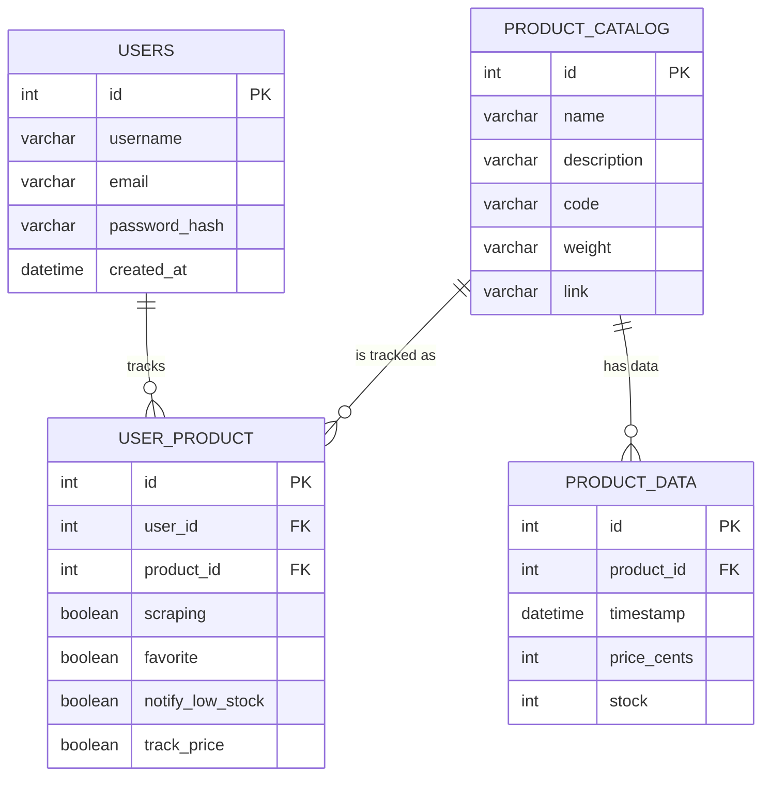
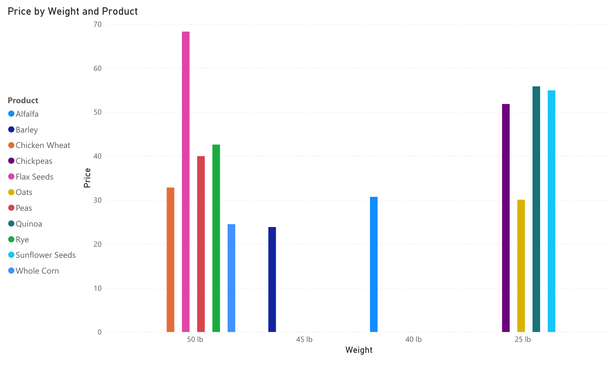

# CS415 Final Database Project

---

## Database Summary Report 

### Project Overview
This database was created for my family to track product data on AzureStandard. In the real world it is connected to a scraping program that captures product data. I wanted to be able to generate reports and show how product prices and stock quantities fluctuate over time. From it I can generate 1, 3, 6, and 12-month averages for prices and stock quantities. I can create all kinds of tables and reports.

I created this database so that it could be attached to a functional user interface so that anyone using AzureStandard could also track prices and stock for the products they need. While originally meant for big bulk purchases many other products can also be tracked specific to the users needs. This database will help users understand product trends over time and be able to see product data all in one place.

### Users Overview

This database is all about the user. A user will be able to use it to see the types of products being scraped and at what times. The user will
be able to use the database to lookup any sort of product data necessary to make the most accurate purchase decisions. They can also see where to buy the
product online.

Users will be able to set their settings for each product, whether they want notifications for low stock, or to track the price. They can also see which
products are favorited so they can make repeat purchases quicker. All of these features will allow for the user to generate reports on products to see price
and stock trends over time.

---

## Database ER Model



*
*

`users`
stores the user data for the database. It's used for log in purposes and so that a user can track specific products to them.

`product_catalog`
contains all the products going to be scraped. It also contains all of their data such as description, weight, link, etc.

`user_product`
stores which products belong to which users. Also allows users to set settings for each product. Settings you can set are track_price, notify_low_stock, scraping, and favorites.

`product_data`
stores the data for each product at the time of the scrape. price_cents is stored to make sure their is no issues with decimal values.

---

## Create Tables

```sql
-- prj1.sql

-- USERS --
CREATE TABLE users (
    id INT AUTO_INCREMENT PRIMARY KEY,
    username VARCHAR(50) NOT NULL UNIQUE,
    email VARCHAR(120) NOT NULL UNIQUE,
    password_hash VARCHAR(255) NOT NULL,
    created_at DATETIME DEFAULT CURRENT_TIMESTAMP,
    INDEX (username)
) ENGINE=InnoDB;


-- PRODUCT_CATALOG --
CREATE TABLE product_catalog (
    id INT AUTO_INCREMENT PRIMARY KEY,
    name VARCHAR(100) NOT NULL,
    description VARCHAR(255),
    code VARCHAR(20) NOT NULL UNIQUE,
    weight VARCHAR(50),
    link VARCHAR(250)
) ENGINE=InnoDB;


-- USER_PRODUCT --
CREATE TABLE user_product (
    id INT AUTO_INCREMENT PRIMARY KEY,
    user_id INT NOT NULL,
    product_id INT NOT NULL,
    scraping BOOLEAN DEFAULT TRUE,
    favorite BOOLEAN DEFAULT FALSE,
    notify_low_stock BOOLEAN DEFAULT FALSE,
    track_price BOOLEAN DEFAULT TRUE,

    FOREIGN KEY (user_id) REFERENCES users(id) ON DELETE CASCADE,
    FOREIGN KEY (product_id) REFERENCES product_catalog(id) ON DELETE CASCADE,

    UNIQUE (user_id, product_id)
) ENGINE=InnoDB;


-- PRODUCT_DATA --
CREATE TABLE product_data (
    id INT AUTO_INCREMENT PRIMARY KEY,
    product_id INT NOT NULL,
    timestamp DATETIME NOT NULL,
    price_cents INT,
    stock INT,

    FOREIGN KEY (product_id) REFERENCES product_catalog(id) ON DELETE CASCADE,
    INDEX (product_id),
    INDEX (timestamp)
) ENGINE=InnoDB;
```

---

## Insert Data

```sql
-- prj2.sql

-- USERS --
INSERT INTO users (id, username, email, password_hash)
VALUES
(1, 'clay', 'wieringac@huntington.edu', 'hash1'),
(2, 'david', 'david@hotmail.com', 'hash2'),
(3, 'ben', 'ben@gmail.com', 'hash3'),
(4, 'jesse', 'jesse@yahoo.com', 'hash4'),
(5, 'eve', 'eve@gmail.com', 'hash5'),
(6, 'frank', 'frank@gmail.com', 'hash6'),
(7, 'grace', 'grace@yahoo.com', 'hash7'),
(8, 'jeff', 'jeff@hotmail.com', 'hash8'),
(9, 'ivan', 'ivan@gmail.com', 'hash9'),
(10, 'nick', 'nick@yahoo.com', 'hash10'),
(11, 'mallory', 'mallory@gmail.com', 'hash11'),
(12, 'nancy', 'nancy@gmail.com', 'hash12'),
(13, 'oliver', 'oliver@hotmail.com', 'hash13'),
(14, 'sam', 'sam@yahoo.com', 'hash14'),
(15, 'quentin', 'quentin@gmail.com', 'hash15'),
(16, 'rachel', 'rachel@yahoo.com', 'hash16'),
(17, 'steve', 'steve@gmail.com', 'hash17'),
(18, 'trent', 'trent@gmail.com', 'hash18'),
(19, 'victor', 'victor@hotmail.com', 'hash19'),
(20, 'dale', 'dale@yahoo.com', 'hash20');


-- PRODUCT_CATALOG --
INSERT INTO product_catalog (id, name, description, code, weight, link)
VALUES
(1, 'Barley', 'Whole Barley - Animal Feed, Organic', 'GP168', '45 lb', 'https://azurestandard.com/barley'),
(2, 'Oats', 'Oats Steel Cut GF Organic', 'CE641', '25 lb', 'https://azurestandard.com/oats'),
(3, 'Chickpeas', 'Garbanzo Beans Organic', 'BE036', '25 lb', 'https://azurestandard.com/chickpeas'),
(4, 'Chicken Wheat', 'Chicken Wheat Animal Feed Organic', 'GP073', '50 lb', 'https://azurestandard.com/chickenwheat'),
(5, 'Alfalfa', 'Alfalfa Pellets Organic', 'GP491', '40 lb', 'https://azurestandard.com/alfalfa'),
(6, 'Peas', 'Field Peas Animal Feed Organic', 'GP559', '50 lb', 'https://azurestandard.com/peas'),
(7, 'Whole Corn', 'Whole Yellow Corn Animal Feed Organic', 'GP850', '50 lb', 'https://azurestandard.com/corn'),
(8, 'Sunflower Seeds', 'Sunflower Seeds Black Oil Organic', 'GP603', '25 lb', 'https://azurestandard.com/sunflower'),
(9, 'Quinoa', 'Quinoa White Organic', 'GR074', '25 lb', 'https://azurestandard.com/quinoa'),
(10, 'Flax Seeds', 'Flax Seeds Organic', 'SE019', '50 lb', 'https://azurestandard.com/flax'),
(11, 'Rye', 'Azure Market Organics Rye Grain', 'GR059', '50 lb', 'https://azurestandard.com/rye');


-- USER_PRODUCT --
INSERT INTO user_product (user_id, product_id, scraping, favorite, notify_low_stock, track_price)
VALUES
(1, 1, TRUE, FALSE, TRUE, TRUE),
(1, 2, TRUE, TRUE, FALSE, TRUE),
(1, 3, TRUE, FALSE, TRUE, TRUE),
(1, 4, TRUE, FALSE, FALSE, TRUE),
(1, 5, TRUE, TRUE, FALSE, TRUE),
(1, 6, TRUE, FALSE, TRUE, TRUE),
(1, 7, TRUE, FALSE, FALSE, TRUE),
(1, 8, TRUE, TRUE, TRUE, TRUE),
(1, 9, TRUE, FALSE, FALSE, TRUE),
(1, 10, TRUE, FALSE, TRUE, TRUE),
(1, 11, TRUE, FALSE, FALSE, TRUE),

(2, 1, TRUE, FALSE, TRUE, TRUE),
(2, 2, TRUE, TRUE, FALSE, TRUE),
(2, 3, TRUE, FALSE, TRUE, TRUE),
(2, 4, TRUE, FALSE, FALSE, TRUE),
(2, 5, TRUE, FALSE, FALSE, TRUE),
(2, 6, TRUE, FALSE, TRUE, TRUE),
(2, 7, TRUE, FALSE, FALSE, TRUE),
(2, 8, TRUE, FALSE, FALSE, TRUE),
(2, 9, TRUE, FALSE, FALSE, TRUE),
(2, 10, TRUE, FALSE, FALSE, TRUE),
(2, 11, TRUE, FALSE, TRUE, TRUE),

(3, 1, TRUE, FALSE, TRUE, TRUE),
(3, 2, TRUE, TRUE, FALSE, TRUE),
(3, 3, TRUE, FALSE, TRUE, TRUE),
(3, 4, TRUE, TRUE, FALSE, TRUE),
(3, 5, TRUE, FALSE, TRUE, TRUE),
(3, 6, TRUE, FALSE, TRUE, TRUE),
(3, 7, TRUE, TRUE, FALSE, TRUE),
(3, 8, TRUE, FALSE, FALSE, TRUE),
(3, 9, TRUE, FALSE, FALSE, TRUE),
(3, 10, TRUE, FALSE, FALSE, TRUE),
(3, 11, TRUE, FALSE, FALSE, TRUE),

(4, 1, TRUE, FALSE, TRUE, TRUE),
(4, 2, TRUE, FALSE, FALSE, TRUE),
(4, 3, TRUE, FALSE, FALSE, TRUE),
(4, 4, TRUE, FALSE, FALSE, TRUE),
(4, 5, TRUE, FALSE, FALSE, TRUE),
(4, 6, TRUE, FALSE, FALSE, TRUE),
(4, 7, TRUE, FALSE, FALSE, TRUE),
(4, 8, TRUE, FALSE, FALSE, TRUE),
(4, 9, TRUE, FALSE, FALSE, TRUE),
(4, 10, TRUE, FALSE, FALSE, TRUE),
(4, 11, TRUE, FALSE, FALSE, TRUE);

(5, 1, TRUE, FALSE, TRUE, TRUE),
(5, 2, TRUE, FALSE, FALSE, TRUE),
(5, 3, TRUE, FALSE, FALSE, TRUE),
(5, 4, TRUE, FALSE, FALSE, TRUE),
(5, 5, TRUE, FALSE, FALSE, TRUE),
(5, 6, TRUE, FALSE, FALSE, TRUE),
(5, 7, TRUE, FALSE, FALSE, TRUE),
(5, 8, TRUE, FALSE, FALSE, TRUE),
(5, 9, TRUE, FALSE, FALSE, TRUE),
(5, 10, TRUE, FALSE, FALSE, TRUE),
(5, 11, TRUE, FALSE, FALSE, TRUE);


-- PRODUCT_DATA --
INSERT INTO product_data (product_id, timestamp, price_cents, stock)
VALUES
(1,'2024-06-24 17:24:47',2358,2589),
(2,'2024-06-24 17:24:47',3068,100),
(3,'2024-06-24 17:24:47',5209,698),
(4,'2024-06-24 17:24:47',3258,1054),
(5,'2024-06-24 17:24:47',3082,1053),
(6,'2024-06-24 17:24:47',4038,358),
(7,'2024-06-24 17:24:47',2473,475),
(8,'2024-06-24 17:24:47',5513,63),
(9,'2024-06-24 17:24:47',5578,1325),
(10,'2024-06-24 17:24:47',6818,824),
(11,'2024-06-24 17:24:47',4239,618),

(1,'2024-07-01 09:00:00',2300,2600),
(2,'2024-07-01 09:00:00',3040,99),
(3,'2024-07-01 09:00:00',5250,700),
(4,'2024-07-01 09:00:00',3300,1052),
(5,'2024-07-01 09:00:00',3100,1050),
(6,'2024-07-01 09:00:00',4050,355),
(7,'2024-07-01 09:00:00',2490,470),
(8,'2024-07-01 09:00:00',5500,60),
(9,'2024-07-01 09:00:00',5600,1320),
(10,'2024-07-01 09:00:00',6850,820),
(11,'2024-07-01 09:00:00',4290,620);

(1,'2024-07-08 09:00:00',2380,2590),
(2,'2024-07-08 09:00:00',3000,98),
(3,'2024-07-08 09:00:00',5180,690),
(4,'2024-07-08 09:00:00',3280,1053),
(5,'2024-07-08 09:00:00',3070,1051),
(6,'2024-07-08 09:00:00',3990,360),
(7,'2024-07-08 09:00:00',2450,478),
(8,'2024-07-08 09:00:00',5490,61),
(9,'2024-07-08 09:00:00',5580,1321),
(10,'2024-07-08 09:00:00',6820,825),
(11,'2024-07-08 09:00:00',4210,615),

(1,'2024-07-15 09:00:00',2380,2690),
(2,'2024-07-15 09:00:00',3000,108),
(3,'2024-07-15 09:00:00',5180,790),
(4,'2024-07-15 09:00:00',3280,1253),
(5,'2024-07-15 09:00:00',3070,951),
(6,'2024-07-15 09:00:00',3990,480),
(7,'2024-07-15 09:00:00',2450,498),
(8,'2024-07-15 09:00:00',5490,91),
(9,'2024-07-15 09:00:00',5580,1621),
(10,'2024-07-15 09:00:00',6820,925),
(11,'2024-07-15 09:00:00',4300,625),

(1,'2024-07-22 09:00:00',2400,2700),
(2,'2024-07-22 09:00:00',3020,107),
(3,'2024-07-22 09:00:00',5220,700),
(4,'2024-07-22 09:00:00',3320,1260),
(5,'2024-07-22 09:00:00',3090,940),
(6,'2024-07-22 09:00:00',4020,470),
(7,'2024-07-22 09:00:00',2480,490),
(8,'2024-07-22 09:00:00',5520,92),
(9,'2024-07-22 09:00:00',5590,1600),
(10,'2024-07-22 09:00:00',6840,928),
(11,'2024-07-22 09:00:00',4310,630),

(1,'2024-07-29 09:00:00',2410,2680),
(2,'2024-07-29 09:00:00',3010,105),
(3,'2024-07-29 09:00:00',5170,710),
(4,'2024-07-29 09:00:00',3270,1240),
(5,'2024-07-29 09:00:00',3050,930),
(6,'2024-07-29 09:00:00',3970,485),
(7,'2024-07-29 09:00:00',2420,460),
(8,'2024-07-29 09:00:00',5460,85),
(9,'2024-07-29 09:00:00',5560,1580),
(10,'2024-07-29 09:00:00',6790,900),
(11,'2024-07-29 09:00:00',4200,600),

(1,'2024-08-05 09:00:00',2390,2670),
(2,'2024-08-05 09:00:00',2990,104),
(3,'2024-08-05 09:00:00',5160,715),
(4,'2024-08-05 09:00:00',3260,1230),
(5,'2024-08-05 09:00:00',3040,920),
(6,'2024-08-05 09:00:00',3960,488),
(7,'2024-08-05 09:00:00',2430,462),
(8,'2024-08-05 09:00:00',5470,83),
(9,'2024-08-05 09:00:00',5570,1590),
(10,'2024-08-05 09:00:00',6810,897),
(11,'2024-08-05 09:00:00',4220,602),

(1,'2024-08-12 09:00:00',2400,2660),
(2,'2024-08-12 09:00:00',2980,102),
(3,'2024-08-12 09:00:00',5150,720),
(4,'2024-08-12 09:00:00',3275,1225),
(5,'2024-08-12 09:00:00',3060,915),
(6,'2024-08-12 09:00:00',3975,490),
(7,'2024-08-12 09:00:00',2440,465),
(8,'2024-08-12 09:00:00',5480,84),
(9,'2024-08-12 09:00:00',5585,1595),
(10,'2024-08-12 09:00:00',6830,910),
(11,'2024-08-12 09:00:00',4260,610),

(1,'2024-08-19 09:00:00',2410,2655),
(2,'2024-08-19 09:00:00',2975,103),
(3,'2024-08-19 09:00:00',5140,725),
(4,'2024-08-19 09:00:00',3290,1218),
(5,'2024-08-19 09:00:00',3075,910),
(6,'2024-08-19 09:00:00',3985,492),
(7,'2024-08-19 09:00:00',2435,468),
(8,'2024-08-19 09:00:00',5495,86),
(9,'2024-08-19 09:00:00',5590,1602),
(10,'2024-08-19 09:00:00',6845,912),
(11,'2024-08-19 09:00:00',4275,612),

(1,'2024-08-26 09:00:00',2425,2668),
(2,'2024-08-26 09:00:00',2985,101),
(3,'2024-08-26 09:00:00',5165,728),
(4,'2024-08-26 09:00:00',3305,1220),
(5,'2024-08-26 09:00:00',3080,920),
(6,'2024-08-26 09:00:00',4000,495),
(7,'2024-08-26 09:00:00',2445,470),
(8,'2024-08-26 09:00:00',5505,87),
(9,'2024-08-26 09:00:00',5600,1608),
(10,'2024-08-26 09:00:00',6855,918),
(11,'2024-08-26 09:00:00',4295,615);
```

---

## Queries

## Query 1 – `SELECT` with `ORDER BY` on two columns

Sort products first by name alphabetically, then by the latest price timestamp descending. Useful for reporting or displaying products.

```sql
SELECT pc.name, pd.timestamp, pd.price_cents
FROM product_catalog pc
JOIN product_data pd ON pc.id = pd.product_id
ORDER BY pc.name ASC, pd.timestamp DESC;
```

**Sample Output**
```code
+-----------------+---------------------+-------------+
| name            | timestamp           | price_cents |
+-----------------+---------------------+-------------+
| Alfalfa         | 2024-08-26 09:00:00 |        3080 |
| Alfalfa         | 2024-08-19 09:00:00 |        3075 |
| Alfalfa         | 2024-08-12 09:00:00 |        3060 |
| Alfalfa         | 2024-08-05 09:00:00 |        3040 |
| Alfalfa         | 2024-07-29 09:00:00 |        3050 |
| Alfalfa         | 2024-07-22 09:00:00 |        3090 |
| Alfalfa         | 2024-07-15 09:00:00 |        3070 |
| Alfalfa         | 2024-07-08 09:00:00 |        3070 |
| Alfalfa         | 2024-07-01 09:00:00 |        3100 |
| Alfalfa         | 2024-06-24 17:24:47 |        3082 |
| Barley          | 2024-08-26 09:00:00 |        2425 |
| Barley          | 2024-08-19 09:00:00 |        2410 |
| Barley          | 2024-08-12 09:00:00 |        2400 |
| Barley          | 2024-08-05 09:00:00 |        2390 |
| Barley          | 2024-07-29 09:00:00 |        2410 |
| Barley          | 2024-07-22 09:00:00 |        2400 |
| Barley          | 2024-07-15 09:00:00 |        2380 |
| Barley          | 2024-07-08 09:00:00 |        2380 |
| Barley          | 2024-07-01 09:00:00 |        2300 |
| Barley          | 2024-06-24 17:24:47 |        2358 |
| Chicken Wheat   | 2024-08-26 09:00:00 |        3305 |
| Chicken Wheat   | 2024-08-19 09:00:00 |        3290 |
| Chicken Wheat   | 2024-08-12 09:00:00 |        3275 |
| Chicken Wheat   | 2024-08-05 09:00:00 |        3260 |
| Chicken Wheat   | 2024-07-29 09:00:00 |        3270 |
| Chicken Wheat   | 2024-07-22 09:00:00 |        3320 |
| Chicken Wheat   | 2024-07-15 09:00:00 |        3280 |
| Chicken Wheat   | 2024-07-08 09:00:00 |        3280 |
| Chicken Wheat   | 2024-07-01 09:00:00 |        3300 |
| Chicken Wheat   | 2024-06-24 17:24:47 |        3258 |
| Chickpeas       | 2024-08-26 09:00:00 |        5165 |
| Chickpeas       | 2024-08-19 09:00:00 |        5140 |
| Chickpeas       | 2024-08-12 09:00:00 |        5150 |
| Chickpeas       | 2024-08-05 09:00:00 |        5160 |
| Chickpeas       | 2024-07-29 09:00:00 |        5170 |
| Chickpeas       | 2024-07-22 09:00:00 |        5220 |
| Chickpeas       | 2024-07-15 09:00:00 |        5180 |
| Chickpeas       | 2024-07-08 09:00:00 |        5180 |
| Chickpeas       | 2024-07-01 09:00:00 |        5250 |
| Chickpeas       | 2024-06-24 17:24:47 |        5209 |
| Flax Seeds      | 2024-08-26 09:00:00 |        6855 |
| Flax Seeds      | 2024-08-19 09:00:00 |        6845 |
| Flax Seeds      | 2024-08-12 09:00:00 |        6830 |
| Flax Seeds      | 2024-08-05 09:00:00 |        6810 |
| Flax Seeds      | 2024-07-29 09:00:00 |        6790 |
| Flax Seeds      | 2024-07-22 09:00:00 |        6840 |
| Flax Seeds      | 2024-07-15 09:00:00 |        6820 |
| Flax Seeds      | 2024-07-08 09:00:00 |        6820 |
| Flax Seeds      | 2024-07-01 09:00:00 |        6850 |
| Flax Seeds      | 2024-06-24 17:24:47 |        6818 |
| Oats            | 2024-08-26 09:00:00 |        2985 |
| Oats            | 2024-08-19 09:00:00 |        2975 |
| Oats            | 2024-08-12 09:00:00 |        2980 |
| Oats            | 2024-08-05 09:00:00 |        2990 |
| Oats            | 2024-07-29 09:00:00 |        3010 |
| Oats            | 2024-07-22 09:00:00 |        3020 |
| Oats            | 2024-07-15 09:00:00 |        3000 |
| Oats            | 2024-07-08 09:00:00 |        3000 |
| Oats            | 2024-07-01 09:00:00 |        3040 |
| Oats            | 2024-06-24 17:24:47 |        3068 |
| Peas            | 2024-08-26 09:00:00 |        4000 |
| Peas            | 2024-08-19 09:00:00 |        3985 |
| Peas            | 2024-08-12 09:00:00 |        3975 |
| Peas            | 2024-08-05 09:00:00 |        3960 |
| Peas            | 2024-07-29 09:00:00 |        3970 |
| Peas            | 2024-07-22 09:00:00 |        4020 |
| Peas            | 2024-07-15 09:00:00 |        3990 |
| Peas            | 2024-07-08 09:00:00 |        3990 |
| Peas            | 2024-07-01 09:00:00 |        4050 |
| Peas            | 2024-06-24 17:24:47 |        4038 |
| Quinoa          | 2024-08-26 09:00:00 |        5600 |
| Quinoa          | 2024-08-19 09:00:00 |        5590 |
| Quinoa          | 2024-08-12 09:00:00 |        5585 |
| Quinoa          | 2024-08-05 09:00:00 |        5570 |
| Quinoa          | 2024-07-29 09:00:00 |        5560 |
| Quinoa          | 2024-07-22 09:00:00 |        5590 |
| Quinoa          | 2024-07-15 09:00:00 |        5580 |
| Quinoa          | 2024-07-08 09:00:00 |        5580 |
| Quinoa          | 2024-07-01 09:00:00 |        5600 |
| Quinoa          | 2024-06-24 17:24:47 |        5578 |
| Rye             | 2024-08-26 09:00:00 |        4295 |
| Rye             | 2024-08-19 09:00:00 |        4275 |
| Rye             | 2024-08-12 09:00:00 |        4260 |
| Rye             | 2024-08-05 09:00:00 |        4220 |
| Rye             | 2024-07-29 09:00:00 |        4200 |
| Rye             | 2024-07-22 09:00:00 |        4310 |
| Rye             | 2024-07-15 09:00:00 |        4300 |
| Rye             | 2024-07-08 09:00:00 |        4210 |
| Rye             | 2024-07-01 09:00:00 |        4290 |
| Rye             | 2024-06-24 17:24:47 |        4239 |
| Sunflower Seeds | 2024-08-26 09:00:00 |        5505 |
| Sunflower Seeds | 2024-08-19 09:00:00 |        5495 |
| Sunflower Seeds | 2024-08-12 09:00:00 |        5480 |
| Sunflower Seeds | 2024-08-05 09:00:00 |        5470 |
| Sunflower Seeds | 2024-07-29 09:00:00 |        5460 |
| Sunflower Seeds | 2024-07-22 09:00:00 |        5520 |
| Sunflower Seeds | 2024-07-15 09:00:00 |        5490 |
| Sunflower Seeds | 2024-07-08 09:00:00 |        5490 |
| Sunflower Seeds | 2024-07-01 09:00:00 |        5500 |
| Sunflower Seeds | 2024-06-24 17:24:47 |        5513 |
| Whole Corn      | 2024-08-26 09:00:00 |        2445 |
| Whole Corn      | 2024-08-19 09:00:00 |        2435 |
| Whole Corn      | 2024-08-12 09:00:00 |        2440 |
| Whole Corn      | 2024-08-05 09:00:00 |        2430 |
| Whole Corn      | 2024-07-29 09:00:00 |        2420 |
| Whole Corn      | 2024-07-22 09:00:00 |        2480 |
| Whole Corn      | 2024-07-15 09:00:00 |        2450 |
| Whole Corn      | 2024-07-08 09:00:00 |        2450 |
| Whole Corn      | 2024-07-01 09:00:00 |        2490 |
| Whole Corn      | 2024-06-24 17:24:47 |        2473 |
+-----------------+---------------------+-------------+
110 rows in set (0.002 sec)
```

---

## Query 2 – `SELECT` with a calculated field (non-aggregate)

Convert price_cents into dollars for easier readability. Maintains structure of previous query while improving readability.

```sql
SELECT pc.name, pd.timestamp, pd.price_cents / 100 AS price_dollars
FROM product_catalog pc
JOIN product_data pd ON pc.id = pd.product_id
ORDER BY pc.name ASC, pd.timestamp DESC;
```

**Sample Output**
```code
+-----------------+---------------------+---------------+
| name            | timestamp           | price_dollars |
+-----------------+---------------------+---------------+
| Alfalfa         | 2024-08-26 09:00:00 |       30.8000 |
| Alfalfa         | 2024-08-19 09:00:00 |       30.7500 |
| Alfalfa         | 2024-08-12 09:00:00 |       30.6000 |
| Alfalfa         | 2024-08-05 09:00:00 |       30.4000 |
| Alfalfa         | 2024-07-29 09:00:00 |       30.5000 |
| Alfalfa         | 2024-07-22 09:00:00 |       30.9000 |
| Alfalfa         | 2024-07-15 09:00:00 |       30.7000 |
| Alfalfa         | 2024-07-08 09:00:00 |       30.7000 |
| Alfalfa         | 2024-07-01 09:00:00 |       31.0000 |
| Alfalfa         | 2024-06-24 17:24:47 |       30.8200 |
| Barley          | 2024-08-26 09:00:00 |       24.2500 |
| Barley          | 2024-08-19 09:00:00 |       24.1000 |
| Barley          | 2024-08-12 09:00:00 |       24.0000 |
| Barley          | 2024-08-05 09:00:00 |       23.9000 |
| Barley          | 2024-07-29 09:00:00 |       24.1000 |
| Barley          | 2024-07-22 09:00:00 |       24.0000 |
| Barley          | 2024-07-15 09:00:00 |       23.8000 |
| Barley          | 2024-07-08 09:00:00 |       23.8000 |
| Barley          | 2024-07-01 09:00:00 |       23.0000 |
| Barley          | 2024-06-24 17:24:47 |       23.5800 |
| Chicken Wheat   | 2024-08-26 09:00:00 |       33.0500 |
| Chicken Wheat   | 2024-08-19 09:00:00 |       32.9000 |
| Chicken Wheat   | 2024-08-12 09:00:00 |       32.7500 |
| Chicken Wheat   | 2024-08-05 09:00:00 |       32.6000 |
| Chicken Wheat   | 2024-07-29 09:00:00 |       32.7000 |
| Chicken Wheat   | 2024-07-22 09:00:00 |       33.2000 |
| Chicken Wheat   | 2024-07-15 09:00:00 |       32.8000 |
| Chicken Wheat   | 2024-07-08 09:00:00 |       32.8000 |
| Chicken Wheat   | 2024-07-01 09:00:00 |       33.0000 |
| Chicken Wheat   | 2024-06-24 17:24:47 |       32.5800 |
| Chickpeas       | 2024-08-26 09:00:00 |       51.6500 |
| Chickpeas       | 2024-08-19 09:00:00 |       51.4000 |
| Chickpeas       | 2024-08-12 09:00:00 |       51.5000 |
| Chickpeas       | 2024-08-05 09:00:00 |       51.6000 |
| Chickpeas       | 2024-07-29 09:00:00 |       51.7000 |
| Chickpeas       | 2024-07-22 09:00:00 |       52.2000 |
| Chickpeas       | 2024-07-15 09:00:00 |       51.8000 |
| Chickpeas       | 2024-07-08 09:00:00 |       51.8000 |
| Chickpeas       | 2024-07-01 09:00:00 |       52.5000 |
| Chickpeas       | 2024-06-24 17:24:47 |       52.0900 |
| Flax Seeds      | 2024-08-26 09:00:00 |       68.5500 |
| Flax Seeds      | 2024-08-19 09:00:00 |       68.4500 |
| Flax Seeds      | 2024-08-12 09:00:00 |       68.3000 |
| Flax Seeds      | 2024-08-05 09:00:00 |       68.1000 |
| Flax Seeds      | 2024-07-29 09:00:00 |       67.9000 |
| Flax Seeds      | 2024-07-22 09:00:00 |       68.4000 |
| Flax Seeds      | 2024-07-15 09:00:00 |       68.2000 |
| Flax Seeds      | 2024-07-08 09:00:00 |       68.2000 |
| Flax Seeds      | 2024-07-01 09:00:00 |       68.5000 |
| Flax Seeds      | 2024-06-24 17:24:47 |       68.1800 |
| Oats            | 2024-08-26 09:00:00 |       29.8500 |
| Oats            | 2024-08-19 09:00:00 |       29.7500 |
| Oats            | 2024-08-12 09:00:00 |       29.8000 |
| Oats            | 2024-08-05 09:00:00 |       29.9000 |
| Oats            | 2024-07-29 09:00:00 |       30.1000 |
| Oats            | 2024-07-22 09:00:00 |       30.2000 |
| Oats            | 2024-07-15 09:00:00 |       30.0000 |
| Oats            | 2024-07-08 09:00:00 |       30.0000 |
| Oats            | 2024-07-01 09:00:00 |       30.4000 |
| Oats            | 2024-06-24 17:24:47 |       30.6800 |
| Peas            | 2024-08-26 09:00:00 |       40.0000 |
| Peas            | 2024-08-19 09:00:00 |       39.8500 |
| Peas            | 2024-08-12 09:00:00 |       39.7500 |
| Peas            | 2024-08-05 09:00:00 |       39.6000 |
| Peas            | 2024-07-29 09:00:00 |       39.7000 |
| Peas            | 2024-07-22 09:00:00 |       40.2000 |
| Peas            | 2024-07-15 09:00:00 |       39.9000 |
| Peas            | 2024-07-08 09:00:00 |       39.9000 |
| Peas            | 2024-07-01 09:00:00 |       40.5000 |
| Peas            | 2024-06-24 17:24:47 |       40.3800 |
| Quinoa          | 2024-08-26 09:00:00 |       56.0000 |
| Quinoa          | 2024-08-19 09:00:00 |       55.9000 |
| Quinoa          | 2024-08-12 09:00:00 |       55.8500 |
| Quinoa          | 2024-08-05 09:00:00 |       55.7000 |
| Quinoa          | 2024-07-29 09:00:00 |       55.6000 |
| Quinoa          | 2024-07-22 09:00:00 |       55.9000 |
| Quinoa          | 2024-07-15 09:00:00 |       55.8000 |
| Quinoa          | 2024-07-08 09:00:00 |       55.8000 |
| Quinoa          | 2024-07-01 09:00:00 |       56.0000 |
| Quinoa          | 2024-06-24 17:24:47 |       55.7800 |
| Rye             | 2024-08-26 09:00:00 |       42.9500 |
| Rye             | 2024-08-19 09:00:00 |       42.7500 |
| Rye             | 2024-08-12 09:00:00 |       42.6000 |
| Rye             | 2024-08-05 09:00:00 |       42.2000 |
| Rye             | 2024-07-29 09:00:00 |       42.0000 |
| Rye             | 2024-07-22 09:00:00 |       43.1000 |
| Rye             | 2024-07-15 09:00:00 |       43.0000 |
| Rye             | 2024-07-08 09:00:00 |       42.1000 |
| Rye             | 2024-07-01 09:00:00 |       42.9000 |
| Rye             | 2024-06-24 17:24:47 |       42.3900 |
| Sunflower Seeds | 2024-08-26 09:00:00 |       55.0500 |
| Sunflower Seeds | 2024-08-19 09:00:00 |       54.9500 |
| Sunflower Seeds | 2024-08-12 09:00:00 |       54.8000 |
| Sunflower Seeds | 2024-08-05 09:00:00 |       54.7000 |
| Sunflower Seeds | 2024-07-29 09:00:00 |       54.6000 |
| Sunflower Seeds | 2024-07-22 09:00:00 |       55.2000 |
| Sunflower Seeds | 2024-07-15 09:00:00 |       54.9000 |
| Sunflower Seeds | 2024-07-08 09:00:00 |       54.9000 |
| Sunflower Seeds | 2024-07-01 09:00:00 |       55.0000 |
| Sunflower Seeds | 2024-06-24 17:24:47 |       55.1300 |
| Whole Corn      | 2024-08-26 09:00:00 |       24.4500 |
| Whole Corn      | 2024-08-19 09:00:00 |       24.3500 |
| Whole Corn      | 2024-08-12 09:00:00 |       24.4000 |
| Whole Corn      | 2024-08-05 09:00:00 |       24.3000 |
| Whole Corn      | 2024-07-29 09:00:00 |       24.2000 |
| Whole Corn      | 2024-07-22 09:00:00 |       24.8000 |
| Whole Corn      | 2024-07-15 09:00:00 |       24.5000 |
| Whole Corn      | 2024-07-08 09:00:00 |       24.5000 |
| Whole Corn      | 2024-07-01 09:00:00 |       24.9000 |
| Whole Corn      | 2024-06-24 17:24:47 |       24.7300 |
+-----------------+---------------------+---------------+
110 rows in set (0.004 sec)
```

---

## Query 3 – `SELECT` using a MariaDB function (non-aggregate)

Extract the month from the timestamp to analyze trends by month. Useful for monthly price or stock trend reports.

```sql
SELECT pc.name, MONTH(pd.timestamp) AS month, pd.price_cents
FROM product_catalog pc
JOIN product_data pd ON pc.id = pd.product_id
ORDER BY pc.name ASC, month;
```

**Sample Output**
```code
+-----------------+-------+-------------+
| name            | month | price_cents |
+-----------------+-------+-------------+
| Alfalfa         |     6 |        3082 |
| Alfalfa         |     7 |        3090 |
| Alfalfa         |     7 |        3070 |
| Alfalfa         |     7 |        3070 |
| Alfalfa         |     7 |        3100 |
| Alfalfa         |     7 |        3050 |
| Alfalfa         |     8 |        3080 |
| Alfalfa         |     8 |        3075 |
| Alfalfa         |     8 |        3060 |
| Alfalfa         |     8 |        3040 |
| Barley          |     6 |        2358 |
| Barley          |     7 |        2410 |
| Barley          |     7 |        2400 |
| Barley          |     7 |        2380 |
| Barley          |     7 |        2380 |
| Barley          |     7 |        2300 |
| Barley          |     8 |        2410 |
| Barley          |     8 |        2400 |
| Barley          |     8 |        2390 |
| Barley          |     8 |        2425 |
| Chicken Wheat   |     6 |        3258 |
| Chicken Wheat   |     7 |        3270 |
| Chicken Wheat   |     7 |        3320 |
| Chicken Wheat   |     7 |        3280 |
| Chicken Wheat   |     7 |        3280 |
| Chicken Wheat   |     7 |        3300 |
| Chicken Wheat   |     8 |        3275 |
| Chicken Wheat   |     8 |        3260 |
| Chicken Wheat   |     8 |        3305 |
| Chicken Wheat   |     8 |        3290 |
| Chickpeas       |     6 |        5209 |
| Chickpeas       |     7 |        5180 |
| Chickpeas       |     7 |        5250 |
| Chickpeas       |     7 |        5170 |
| Chickpeas       |     7 |        5220 |
| Chickpeas       |     7 |        5180 |
| Chickpeas       |     8 |        5165 |
| Chickpeas       |     8 |        5140 |
| Chickpeas       |     8 |        5150 |
| Chickpeas       |     8 |        5160 |
| Flax Seeds      |     6 |        6818 |
| Flax Seeds      |     7 |        6790 |
| Flax Seeds      |     7 |        6840 |
| Flax Seeds      |     7 |        6820 |
| Flax Seeds      |     7 |        6820 |
| Flax Seeds      |     7 |        6850 |
| Flax Seeds      |     8 |        6855 |
| Flax Seeds      |     8 |        6845 |
| Flax Seeds      |     8 |        6830 |
| Flax Seeds      |     8 |        6810 |
| Oats            |     6 |        3068 |
| Oats            |     7 |        3010 |
| Oats            |     7 |        3020 |
| Oats            |     7 |        3000 |
| Oats            |     7 |        3000 |
| Oats            |     7 |        3040 |
| Oats            |     8 |        2985 |
| Oats            |     8 |        2975 |
| Oats            |     8 |        2980 |
| Oats            |     8 |        2990 |
| Peas            |     6 |        4038 |
| Peas            |     7 |        4050 |
| Peas            |     7 |        3970 |
| Peas            |     7 |        4020 |
| Peas            |     7 |        3990 |
| Peas            |     7 |        3990 |
| Peas            |     8 |        4000 |
| Peas            |     8 |        3985 |
| Peas            |     8 |        3975 |
| Peas            |     8 |        3960 |
| Quinoa          |     6 |        5578 |
| Quinoa          |     7 |        5560 |
| Quinoa          |     7 |        5590 |
| Quinoa          |     7 |        5580 |
| Quinoa          |     7 |        5580 |
| Quinoa          |     7 |        5600 |
| Quinoa          |     8 |        5590 |
| Quinoa          |     8 |        5585 |
| Quinoa          |     8 |        5570 |
| Quinoa          |     8 |        5600 |
| Rye             |     6 |        4239 |
| Rye             |     7 |        4210 |
| Rye             |     7 |        4290 |
| Rye             |     7 |        4200 |
| Rye             |     7 |        4310 |
| Rye             |     7 |        4300 |
| Rye             |     8 |        4295 |
| Rye             |     8 |        4275 |
| Rye             |     8 |        4260 |
| Rye             |     8 |        4220 |
| Sunflower Seeds |     6 |        5513 |
| Sunflower Seeds |     7 |        5490 |
| Sunflower Seeds |     7 |        5490 |
| Sunflower Seeds |     7 |        5500 |
| Sunflower Seeds |     7 |        5460 |
| Sunflower Seeds |     7 |        5520 |
| Sunflower Seeds |     8 |        5505 |
| Sunflower Seeds |     8 |        5495 |
| Sunflower Seeds |     8 |        5480 |
| Sunflower Seeds |     8 |        5470 |
| Whole Corn      |     6 |        2473 |
| Whole Corn      |     7 |        2420 |
| Whole Corn      |     7 |        2480 |
| Whole Corn      |     7 |        2450 |
| Whole Corn      |     7 |        2450 |
| Whole Corn      |     7 |        2490 |
| Whole Corn      |     8 |        2430 |
| Whole Corn      |     8 |        2445 |
| Whole Corn      |     8 |        2435 |
| Whole Corn      |     8 |        2440 |
+-----------------+-------+-------------+
110 rows in set (0.001 sec)
```

---

## Query 4 – Aggregation with `GROUP BY` and `HAVING`

Find products that have an average price over $50 (5000 cents) for all recorded data. Useful for filtering expensive products.
```sql
SELECT 
    pc.name, 
    ROUND(AVG(pd.price_cents) / 100.0, 2) AS avg_price_dollars
FROM product_catalog pc
JOIN product_data pd ON pc.id = pd.product_id
GROUP BY pc.name
HAVING AVG(pd.price_cents) / 100.0 > 50;
```

**Sample Output**
```code
+-----------------+-------------------+
| name            | avg_price_dollars |
+-----------------+-------------------+
| Chickpeas       |             51.82 |
| Flax Seeds      |             68.28 |
| Quinoa          |             55.83 |
| Sunflower Seeds |             54.92 |
+-----------------+-------------------+
4 rows in set (0.002 sec)
```
---

## Query 5 – Join of three tables

Joins `user_product`, `product_catalog`, `product_data`. Retrieve user favorites with price and stock in order by date.

```sql
SELECT u.username, pc.name AS product_name, pd.timestamp ,pd.price_cents, pd.stock
FROM users u
INNER JOIN user_product up ON u.id = up.user_id
INNER JOIN product_catalog pc ON up.product_id = pc.id
INNER JOIN product_data pd ON pc.id = pd.product_id
WHERE up.favorite = TRUE
ORDER BY u.username, pd.timestamp DESC;
```

**Sample Output**
```code
+----------+-----------------+---------------------+-------------+-------+
| username | product_name    | timestamp           | price_cents | stock |
+----------+-----------------+---------------------+-------------+-------+
| ben      | Chicken Wheat   | 2024-08-26 09:00:00 |        3305 |  1220 |
| ben      | Oats            | 2024-08-26 09:00:00 |        2985 |   101 |
| ben      | Whole Corn      | 2024-08-26 09:00:00 |        2445 |   470 |
| ben      | Oats            | 2024-08-19 09:00:00 |        2975 |   103 |
| ben      | Whole Corn      | 2024-08-19 09:00:00 |        2435 |   468 |
| ben      | Chicken Wheat   | 2024-08-19 09:00:00 |        3290 |  1218 |
| ben      | Whole Corn      | 2024-08-12 09:00:00 |        2440 |   465 |
| ben      | Chicken Wheat   | 2024-08-12 09:00:00 |        3275 |  1225 |
| ben      | Oats            | 2024-08-12 09:00:00 |        2980 |   102 |
| ben      | Oats            | 2024-08-05 09:00:00 |        2990 |   104 |
| ben      | Whole Corn      | 2024-08-05 09:00:00 |        2430 |   462 |
| ben      | Chicken Wheat   | 2024-08-05 09:00:00 |        3260 |  1230 |
| ben      | Oats            | 2024-07-29 09:00:00 |        3010 |   105 |
| ben      | Whole Corn      | 2024-07-29 09:00:00 |        2420 |   460 |
| ben      | Chicken Wheat   | 2024-07-29 09:00:00 |        3270 |  1240 |
| ben      | Oats            | 2024-07-22 09:00:00 |        3020 |   107 |
| ben      | Whole Corn      | 2024-07-22 09:00:00 |        2480 |   490 |
| ben      | Chicken Wheat   | 2024-07-22 09:00:00 |        3320 |  1260 |
| ben      | Oats            | 2024-07-15 09:00:00 |        3000 |   108 |
| ben      | Whole Corn      | 2024-07-15 09:00:00 |        2450 |   498 |
| ben      | Chicken Wheat   | 2024-07-15 09:00:00 |        3280 |  1253 |
| ben      | Chicken Wheat   | 2024-07-08 09:00:00 |        3280 |  1053 |
| ben      | Oats            | 2024-07-08 09:00:00 |        3000 |    98 |
| ben      | Whole Corn      | 2024-07-08 09:00:00 |        2450 |   478 |
| ben      | Oats            | 2024-07-01 09:00:00 |        3040 |    99 |
| ben      | Whole Corn      | 2024-07-01 09:00:00 |        2490 |   470 |
| ben      | Chicken Wheat   | 2024-07-01 09:00:00 |        3300 |  1052 |
| ben      | Chicken Wheat   | 2024-06-24 17:24:47 |        3258 |  1054 |
| ben      | Oats            | 2024-06-24 17:24:47 |        3068 |   100 |
| ben      | Whole Corn      | 2024-06-24 17:24:47 |        2473 |   475 |
| clay     | Oats            | 2024-08-26 09:00:00 |        2985 |   101 |
| clay     | Sunflower Seeds | 2024-08-26 09:00:00 |        5505 |    87 |
| clay     | Alfalfa         | 2024-08-26 09:00:00 |        3080 |   920 |
| clay     | Alfalfa         | 2024-08-19 09:00:00 |        3075 |   910 |
| clay     | Oats            | 2024-08-19 09:00:00 |        2975 |   103 |
| clay     | Sunflower Seeds | 2024-08-19 09:00:00 |        5495 |    86 |
| clay     | Oats            | 2024-08-12 09:00:00 |        2980 |   102 |
| clay     | Sunflower Seeds | 2024-08-12 09:00:00 |        5480 |    84 |
| clay     | Alfalfa         | 2024-08-12 09:00:00 |        3060 |   915 |
| clay     | Alfalfa         | 2024-08-05 09:00:00 |        3040 |   920 |
| clay     | Oats            | 2024-08-05 09:00:00 |        2990 |   104 |
| clay     | Sunflower Seeds | 2024-08-05 09:00:00 |        5470 |    83 |
| clay     | Oats            | 2024-07-29 09:00:00 |        3010 |   105 |
| clay     | Sunflower Seeds | 2024-07-29 09:00:00 |        5460 |    85 |
| clay     | Alfalfa         | 2024-07-29 09:00:00 |        3050 |   930 |
| clay     | Sunflower Seeds | 2024-07-22 09:00:00 |        5520 |    92 |
| clay     | Alfalfa         | 2024-07-22 09:00:00 |        3090 |   940 |
| clay     | Oats            | 2024-07-22 09:00:00 |        3020 |   107 |
| clay     | Oats            | 2024-07-15 09:00:00 |        3000 |   108 |
| clay     | Sunflower Seeds | 2024-07-15 09:00:00 |        5490 |    91 |
| clay     | Alfalfa         | 2024-07-15 09:00:00 |        3070 |   951 |
| clay     | Sunflower Seeds | 2024-07-08 09:00:00 |        5490 |    61 |
| clay     | Alfalfa         | 2024-07-08 09:00:00 |        3070 |  1051 |
| clay     | Oats            | 2024-07-08 09:00:00 |        3000 |    98 |
| clay     | Alfalfa         | 2024-07-01 09:00:00 |        3100 |  1050 |
| clay     | Oats            | 2024-07-01 09:00:00 |        3040 |    99 |
| clay     | Sunflower Seeds | 2024-07-01 09:00:00 |        5500 |    60 |
| clay     | Oats            | 2024-06-24 17:24:47 |        3068 |   100 |
| clay     | Sunflower Seeds | 2024-06-24 17:24:47 |        5513 |    63 |
| clay     | Alfalfa         | 2024-06-24 17:24:47 |        3082 |  1053 |
| david    | Oats            | 2024-08-26 09:00:00 |        2985 |   101 |
| david    | Oats            | 2024-08-19 09:00:00 |        2975 |   103 |
| david    | Oats            | 2024-08-12 09:00:00 |        2980 |   102 |
| david    | Oats            | 2024-08-05 09:00:00 |        2990 |   104 |
| david    | Oats            | 2024-07-29 09:00:00 |        3010 |   105 |
| david    | Oats            | 2024-07-22 09:00:00 |        3020 |   107 |
| david    | Oats            | 2024-07-15 09:00:00 |        3000 |   108 |
| david    | Oats            | 2024-07-08 09:00:00 |        3000 |    98 |
| david    | Oats            | 2024-07-01 09:00:00 |        3040 |    99 |
| david    | Oats            | 2024-06-24 17:24:47 |        3068 |   100 |
+----------+-----------------+---------------------+-------------+-------+
70 rows in set (0.003 sec)
```

---

## Query 6 – `LEFT JOIN`

List all users and any products they are tracking, including users who aren’t tracking anything. Useful for identifying inactive users.

```sql
SELECT u.username, pc.name AS product_name, up.track_price
FROM users u
LEFT JOIN user_product up ON u.id = up.user_id
LEFT JOIN product_catalog pc ON up.product_id = pc.id
ORDER BY u.username;
```

**Sample Output**
```code
+----------+-----------------+-------------+
| username | product_name    | track_price |
+----------+-----------------+-------------+
| ben      | Barley          |           1 |
| ben      | Oats            |           1 |
| ben      | Chickpeas       |           1 |
| ben      | Chicken Wheat   |           1 |
| ben      | Alfalfa         |           1 |
| ben      | Peas            |           1 |
| ben      | Whole Corn      |           1 |
| ben      | Sunflower Seeds |           1 |
| ben      | Quinoa          |           1 |
| ben      | Flax Seeds      |           1 |
| ben      | Rye             |           1 |
| clay     | Barley          |           1 |
| clay     | Oats            |           1 |
| clay     | Chickpeas       |           1 |
| clay     | Chicken Wheat   |           1 |
| clay     | Alfalfa         |           1 |
| clay     | Peas            |           1 |
| clay     | Whole Corn      |           1 |
| clay     | Sunflower Seeds |           1 |
| clay     | Quinoa          |           1 |
| clay     | Flax Seeds      |           1 |
| clay     | Rye             |           1 |
| dale     | NULL            |        NULL |
| david    | Barley          |           0 |
| david    | Oats            |           1 |
| david    | Chickpeas       |           0 |
| david    | Chicken Wheat   |           1 |
| david    | Alfalfa         |           0 |
| david    | Peas            |           1 |
| david    | Whole Corn      |           1 |
| david    | Sunflower Seeds |           1 |
| david    | Quinoa          |           1 |
| david    | Flax Seeds      |           1 |
| david    | Rye             |           1 |
| eve      | Barley          |           1 |
| eve      | Oats            |           1 |
| eve      | Chickpeas       |           1 |
| eve      | Chicken Wheat   |           1 |
| eve      | Alfalfa         |           1 |
| eve      | Peas            |           1 |
| eve      | Whole Corn      |           1 |
| eve      | Sunflower Seeds |           1 |
| eve      | Quinoa          |           1 |
| eve      | Flax Seeds      |           1 |
| eve      | Rye             |           1 |
| frank    | NULL            |        NULL |
| grace    | NULL            |        NULL |
| ivan     | NULL            |        NULL |
| jeff     | NULL            |        NULL |
| jesse    | Barley          |           1 |
| jesse    | Oats            |           1 |
| jesse    | Chickpeas       |           1 |
| jesse    | Chicken Wheat   |           1 |
| jesse    | Alfalfa         |           1 |
| jesse    | Peas            |           1 |
| jesse    | Whole Corn      |           1 |
| jesse    | Sunflower Seeds |           1 |
| jesse    | Quinoa          |           1 |
| jesse    | Flax Seeds      |           1 |
| jesse    | Rye             |           1 |
| mallory  | NULL            |        NULL |
| nancy    | NULL            |        NULL |
| nick     | NULL            |        NULL |
| oliver   | NULL            |        NULL |
| quentin  | NULL            |        NULL |
| rachel   | NULL            |        NULL |
| sam      | NULL            |        NULL |
| steve    | NULL            |        NULL |
| trent    | NULL            |        NULL |
| victor   | NULL            |        NULL |
+----------+-----------------+-------------+
70 rows in set (0.004 sec)
```

---

## Query 7 – `UPDATE` query

Update notify_low_stock for a user-product pair. Used when a user decides to turn notifications for low stock on or off.

```sql
SELECT user_id, product_id, notify_low_stock
FROM user_product
WHERE user_id = 1 AND product_id = 2;

UPDATE user_product
SET notify_low_stock = TRUE
WHERE user_id = 1 AND product_id = 2;

SELECT user_id, product_id, notify_low_stock
FROM user_product
WHERE user_id = 1 AND product_id = 2;
```

**Sample Output**
```code
+---------+------------+------------------+
| user_id | product_id | notify_low_stock |
+---------+------------+------------------+
|       1 |          2 |                0 |
+---------+------------+------------------+

+---------+------------+------------------+
| user_id | product_id | notify_low_stock |
+---------+------------+------------------+
|       1 |          2 |                1 |
+---------+------------+------------------+
```

---

## Query 8 – `DELETE` query

Remove a product from a user's tracking list. For when a user no longer wants to track a product.


```sql
SELECT user_id, product_id, notify_low_stock
FROM user_product
WHERE user_id = 3 AND product_id = 5;

DELETE FROM user_product
WHERE user_id = 3 AND product_id = 5;

SELECT user_id, product_id, notify_low_stock
FROM user_product
WHERE user_id = 3 AND product_id = 5;
```

**Sample Output**
```code
+---------+------------+------------------+
| user_id | product_id | notify_low_stock |
+---------+------------+------------------+
|       3 |          5 |                1 |
+---------+------------+------------------+

    -> SELECT user_id, product_id, notify_low_stock
    -> FROM user_product
    -> WHERE user_id = 3 AND product_id = 5;
Empty set (0.001 sec)
```

---

## Query 9 – Create a `VIEW` and use it

Create a simplified view of users favorite products with latest price and stock. Makes a convenient dashboard.

```sql
CREATE VIEW user_favorites_latest AS
SELECT u.username, pc.name AS product_name, pd.price_cents, pd.stock
FROM users u
JOIN user_product up ON u.id = up.user_id
JOIN product_catalog pc ON up.product_id = pc.id
JOIN product_data pd ON pc.id = pd.product_id
WHERE up.favorite = TRUE
AND pd.timestamp = (SELECT MAX(timestamp) FROM product_data WHERE product_id = pc.id);

SELECT * FROM user_favorites_latest;
```

**Sample Output**
```code
+----------+-----------------+-------------+-------+
| username | product_name    | price_cents | stock |
+----------+-----------------+-------------+-------+
| clay     | Oats            |        2985 |   101 |
| david    | Oats            |        2985 |   101 |
| ben      | Oats            |        2985 |   101 |
| ben      | Chicken Wheat   |        3305 |  1220 |
| clay     | Alfalfa         |        3080 |   920 |
| ben      | Whole Corn      |        2445 |   470 |
| clay     | Sunflower Seeds |        5505 |    87 |
+----------+-----------------+-------------+-------+
```
---

## Query 10 – Transaction with `ROLLBACK`

Safely updates the track_price for several products. Rollback undoes the decision and price tracking goes back to normal.

```sql
SELECT user_id, product_id, track_price
FROM user_product
WHERE user_id = 2 AND product_id IN (1, 3, 5);

START TRANSACTION;

UPDATE user_product
SET track_price = FALSE
WHERE user_id = 2 AND product_id IN (1, 3, 5);

SELECT user_id, product_id, track_price
FROM user_product
WHERE user_id = 2 AND product_id IN (1, 3, 5);

ROLLBACK;

SELECT user_id, product_id, track_price
FROM user_product
WHERE user_id = 2 AND product_id IN (1, 3, 5);
```

---

**Sample Output**
```code
+---------+------------+-------------+
| user_id | product_id | track_price |
+---------+------------+-------------+
|       2 |          1 |           1 |
|       2 |          3 |           1 |
|       2 |          5 |           1 |
+---------+------------+-------------+
3 rows in set (0.001 sec)

MariaDB [CS415]> 
MariaDB [CS415]> START TRANSACTION;
Query OK, 0 rows affected (0.000 sec)

MariaDB [CS415]> 
MariaDB [CS415]> -- Temporarily set track_price to FALSE
MariaDB [CS415]> UPDATE user_product
    -> SET track_price = FALSE
    -> WHERE user_id = 2 AND product_id IN (1, 3, 5);
Query OK, 3 rows affected (0.000 sec)
Rows matched: 3  Changed: 3  Warnings: 0

MariaDB [CS415]> 
MariaDB [CS415]> -- See the changed values inside the transaction
MariaDB [CS415]> SELECT user_id, product_id, track_price
    -> FROM user_product
    -> WHERE user_id = 2 AND product_id IN (1, 3, 5);
+---------+------------+-------------+
| user_id | product_id | track_price |
+---------+------------+-------------+
|       2 |          1 |           0 |
|       2 |          3 |           0 |
|       2 |          5 |           0 |
+---------+------------+-------------+
3 rows in set (0.000 sec)

MariaDB [CS415]> 
MariaDB [CS415]> -- Decide to undo the change
MariaDB [CS415]> ROLLBACK;
Query OK, 0 rows affected (0.000 sec)

MariaDB [CS415]> 
MariaDB [CS415]> -- Confirm track_price is back to the original values
MariaDB [CS415]> SELECT user_id, product_id, track_price
    -> FROM user_product
    -> WHERE user_id = 2 AND product_id IN (1, 3, 5);
+---------+------------+-------------+
| user_id | product_id | track_price |
+---------+------------+-------------+
|       2 |          1 |           1 |
|       2 |          3 |           1 |
|       2 |          5 |           1 |
+---------+------------+-------------+
3 rows in set (0.001 sec)
```
---

## Reports

**PowerBI Graph**


**PowerBI Graph**
[PowerBI Graph](productGraph.png "PowerBI Graph")

---

## Delete Tables

```sql
-- prj4.sql

-- drop tables --
drop table user_product_settings;
drop table product_data;
drop table product;
drop table users;

```

---

## Poster

[Poster PDF](poster.pdf)

---

